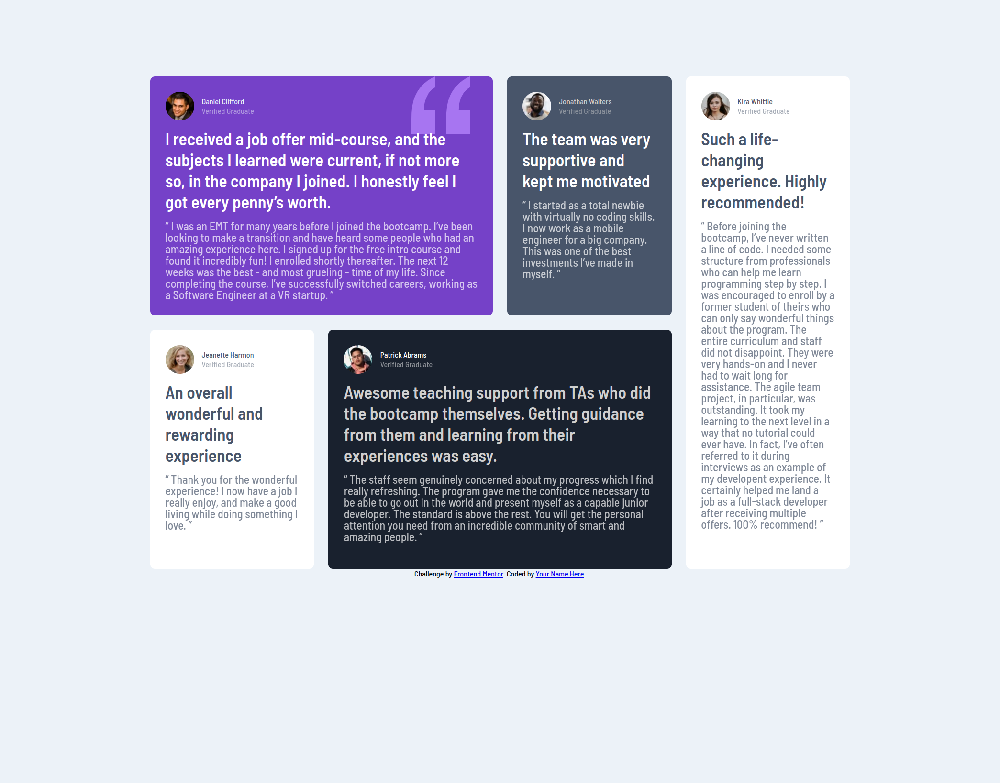

# Frontend Mentor - Testimonials grid section solution

This is a solution to the [Testimonials grid section challenge on Frontend Mentor](https://www.frontendmentor.io/challenges/testimonials-grid-section-Nnw6J7Un7). Frontend Mentor challenges help you improve your coding skills by building realistic projects. 

## Table of contents

- [Overview](#overview)
  - [The challenge](#the-challenge)
  - [Screenshot](#screenshot)
  - [Links](#links)
- [My process](#my-process)
  - [Built with](#built-with)
  - [What I learned](#what-i-learned)
  - [Continued development](#continued-development)
  - [Useful resources](#useful-resources)
- [Author](#author)
- [Acknowledgments](#acknowledgments)

## Overview

### The challenge

Users should be able to:

- View the optimal layout for the site depending on their device's screen size

### Screenshot
### mobile

### desktop

### Links
- Live Site URL: [visit project live site ](https://cafferti.github.io/testimonial-fm/)

## My process

### Built with

- Semantic HTML5 markup
- CSS custom properties
- Flexbox
- CSS Grid
- Mobile-first workflow

### What I learned

efficient use of grid

### Useful resources

- [font awesome](https://www.fontawesome.com) - This helped me to obtain my logos and social links. I really liked this pattern and will use it going forward.
- [google fonts](https://www.googlefonts.com) - This is an amazing website which helped me obtain all the fonts used in this project. I'd recommend it to anyone still learning this concept.

## Author

- instagram - [@saul](https://www.instagram.com/dude_christiian)
- Frontend Mentor - [@cafferti](https://www.frontendmentor.io/profile/cafferti)
- Twitter - [@broke-cafferti](https://www.twitter.com/saulkumvee)
 

